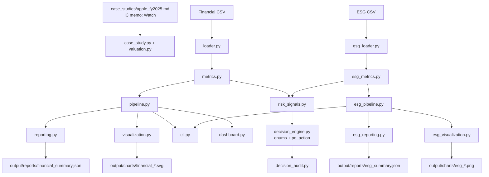

# Project Architecture

This repository is positioned as a **PE / Growth Equity underwriting workflow**.

**Primary output:** [`case_studies/apple_fy2025.md`](../case_studies/apple_fy2025.md) — IC-style memo with Invest / Watch / Pass framing (working conclusion **Watch**), downside sensitivity, and public-data DD gaps.

**Supporting engines (reuse, do not sprawl):** `case_study.py` / `valuation.py` / `forecasting.py` / `metrics.py` / `risk_signals.py` / `decision_engine.py`.

Optional surfaces (API, Streamlit, chart exports) exist for demos; they are not required to deliver the memo.

Hero path:

```text
Accounting → Underwriting → Valuation → Risk → Monitoring decision
```

The package still contains two related sample workflows:

1. Financial statement analysis (ratios, reports)
2. ESG portfolio analysis (sample investee monitoring)

Both feed the same explainable-signal and decision layer used for PE-style monitoring labels.

## System Diagram



## Module Boundaries

### Financial Workflow

- `models.py`
  - data contracts for financial records, period metrics, and summary output
- `loader.py`
  - CSV validation and parsing
- `metrics.py`
  - profitability, liquidity, and leverage calculations
- `pipeline.py`
  - orchestration for financial analysis outputs
- `reporting.py`
  - console, Markdown, and JSON output
- `visualization.py`
  - static SVG chart generation

### ESG Workflow

- `esg_models.py`
  - data contracts for ESG insights and summary output
- `esg_loader.py`
  - CSV loading, duplicate removal, missing-value handling, derived ESG metrics
- `esg_metrics.py`
  - sector summaries, correlation analysis, risk signal construction, business insights
- `esg_pipeline.py`
  - orchestration for ESG reports and plots
- `esg_reporting.py`
  - business-facing ESG summary output
- `esg_visualization.py`
  - matplotlib and seaborn visualizations

### Shared Delivery Surface

- `cli.py`
  - root financial workflow
  - `esg` subcommand for the ESG workflow
- `dashboard.py`
  - top-level Streamlit dashboard launcher
- `financial_dashboard.py`
  - financial Streamlit view and UI helpers
- `esg_dashboard.py`
  - ESG Streamlit view, risk review, and cleaning-audit helpers

## Data Contracts

- Financial input schema and metric definitions are documented in [data_dictionary.md](C:/Users/Zixsa/Kozphy/financial-analysis-tool/docs/data_dictionary.md).
- ESG input schema, imputation rules, and derived fields are also documented there.
- This keeps the business contract explicit instead of burying it in loader code alone.

## Execution Paths

### Financial Path

```text
main.py
  -> cli.py
  -> pipeline.py
  -> loader.py
  -> metrics.py
  -> reporting.py
  -> visualization.py
```

### ESG Path

```text
main.py esg
  -> cli.py
  -> esg_pipeline.py
  -> esg_loader.py
  -> esg_metrics.py
  -> esg_reporting.py
  -> esg_visualization.py
```

The detailed input-to-output flow for both paths is documented in [data_pipeline.md](C:/Users/Zixsa/Kozphy/financial-analysis-tool/docs/data_pipeline.md).

## Design Principles

- Lead with the IC memo and reproducible underwriting numbers; treat UI/API as optional.
- Keep business logic separate from UI and file output.
- Keep the financial / valuation workflow lightweight and standard-library based where possible.
- Use pandas, numpy, matplotlib, and seaborn only where they add value: ESG cleaning, analysis, and visual exploration.
- Prefer explainable rules and audit trails over ML scoring.
- Do not fake private diligence; mark DD gaps honestly.
- Make outputs readable for PE / Deal Advisory associates, not only engineers.
- Keep optional workflows explicit so users understand which dependencies are required.

## ESG Analysis Focus

The ESG workflow is built to surface signals useful in investee monitoring:
- trend in carbon intensity
- correlation between ESG quality and sustainability indicators
- latest-year risk signals mapped to PE monitoring actions

Apple IC evidence stays on public financials; generic ESG sample data is not presented as Apple private DD.
