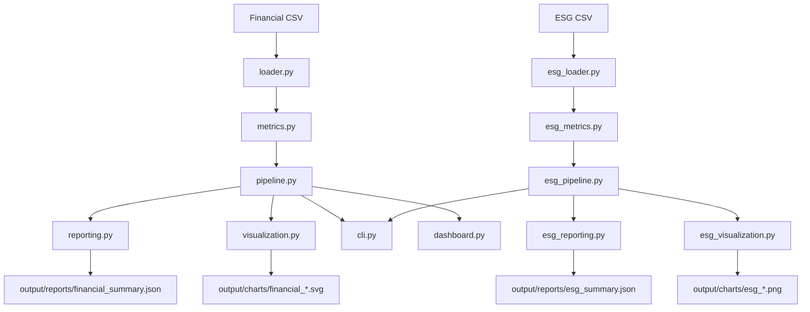

# Project Architecture

This project now has two related workflows under one package:

1. Financial statement analysis
2. ESG portfolio analysis

The design goal is to keep both workflows small, transparent, and interview-friendly while still reflecting the kind of analysis a financial institution would care about.

## System Diagram



## Module Boundaries

### Financial Workflow

- `models.py`
  - data contracts for financial records, period metrics, and summary output
- `loader.py`
  - CSV validation and parsing
- `metrics.py`
  - profitability, liquidity, and leverage calculations
- `pipeline.py`
  - orchestration for financial analysis outputs
- `reporting.py`
  - console, Markdown, and JSON output
- `visualization.py`
  - static SVG chart generation

### ESG Workflow

- `esg_models.py`
  - data contracts for ESG insights and summary output
- `esg_loader.py`
  - CSV loading, duplicate removal, missing-value handling, derived ESG metrics
- `esg_metrics.py`
  - sector summaries, correlation analysis, risk signal construction, business insights
- `esg_pipeline.py`
  - orchestration for ESG reports and plots
- `esg_reporting.py`
  - business-facing ESG summary output
- `esg_visualization.py`
  - matplotlib and seaborn visualizations

### Shared Delivery Surface

- `cli.py`
  - root financial workflow
  - `esg` subcommand for the ESG workflow
- `dashboard.py`
  - optional Streamlit UI for the financial workflow

## Execution Paths

### Financial Path

```text
main.py
  -> cli.py
  -> pipeline.py
  -> loader.py
  -> metrics.py
  -> reporting.py
  -> visualization.py
```

### ESG Path

```text
main.py esg
  -> cli.py
  -> esg_pipeline.py
  -> esg_loader.py
  -> esg_metrics.py
  -> esg_reporting.py
  -> esg_visualization.py
```

## Design Principles

- Keep business logic separate from UI and file output.
- Keep the financial workflow lightweight and standard-library based.
- Use pandas, numpy, matplotlib, and seaborn only where they add value: ESG cleaning, analysis, and visual exploration.
- Make outputs readable for finance stakeholders, not only engineers.

## ESG Analysis Focus

The ESG workflow is built to surface signals useful in a financial institution:
- trend in carbon intensity
- correlation between ESG quality and sustainability indicators
- latest-year risk signals for investee monitoring

This makes the repo suitable for junior ESG, sustainability, data, and finance-role applications.
