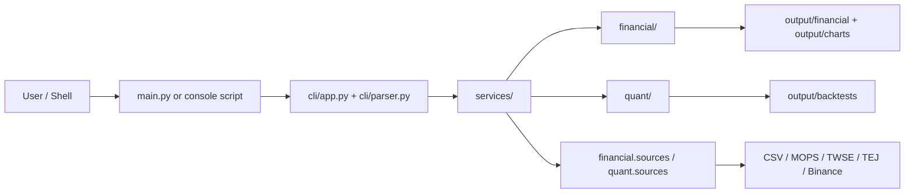

# Architecture

This project uses a small, explicit layered architecture that keeps command-line concerns, workflow orchestration, domain logic, and provider integrations separate.

## System Overview



## Layer Responsibilities

| Layer | Responsibility |
| --- | --- |
| `cli/` | Parse arguments, expose commands, convert user intent into config objects |
| `services/` | Orchestrate full workflows and persist outputs |
| `financial/` | Financial statement models, metrics, summary generation, chart creation |
| `quant/` | Price models, factor calculation, ranking, portfolio construction, backtesting |
| `financial.sources/` | Financial data provider abstraction and registry |
| `quant.sources/` | Market data provider abstraction and registry |
| `core/` | Shared config, exceptions, JSON I/O, HTTP helpers, logging, utility functions |

## Execution Paths

### Financial Analysis

```text
main.py
-> cli.app
-> cli.parser
-> cli.financial_cli
-> services.financial_service
-> financial.sources registry
-> financial.metrics
-> financial.reporting
-> financial.visualization
-> output/financial + output/charts
```

### Quant Backtest

```text
main.py backtest
-> cli.app
-> cli.parser
-> cli.backtest_cli
-> services.backtest_service
-> quant.sources registry
-> quant.factors
-> quant.strategy
-> quant.portfolio
-> quant.backtest
-> quant.reporting
-> output/backtests
```

## Provider Abstraction

Both financial and quant data flows use provider registries so the domain logic stays independent from the data source.

- financial providers: local CSV and Taiwan MOPS
- market providers: local CSV, Binance Spot, TWSE, and TEJ
- shared HTTP concerns such as retries, caching, and backoff live in `core/`

This keeps the backtest and financial analysis engines focused on normalized models instead of transport or parsing details.

## Design Choices

### Standard Library First

The runtime path stays lightweight and interview-friendly. Most of the code can be read without learning a heavy framework or hidden abstraction layer.

### Workflow-Oriented Services

`services/` modules tie together loading, computation, and persistence. That makes the CLI thin while keeping the business logic reusable from tests and future interfaces.

### Clean CLI Dispatch

The CLI now separates parser construction from execution. `cli/parser.py` owns the argument graph, while `cli/app.py` configures logging and dispatches to the handler attached to the parsed command.

### Explicit Data Contracts

The key domain objects are dataclasses:

- financial records and per-period analyses in `financial.models`
- price records, factor snapshots, ranked assets, and backtest results in `quant.models`

### Testable Provider Integrations

Remote providers are validated with saved fixtures in `tests/fixtures/`, which avoids flaky network tests while still exercising real response formats.

## Output Conventions

The repo keeps generated artifacts under `output/`:

```text
output/
|-- financial/   # JSON summaries
|-- charts/      # SVG charts
|-- backtests/   # JSON backtest reports
`-- logs/        # Optional local logs
```

This structure keeps demos, screenshots, and generated artifacts easy to navigate in a portfolio setting.

## Current Tradeoffs

- The CLI is the primary interface; there is no web API yet.
- Services still own file persistence, which is fine for a CLI-first repo but could move outward in a larger system.
- The backtest intentionally stays lightweight and transparent rather than trying to be a full research platform.
