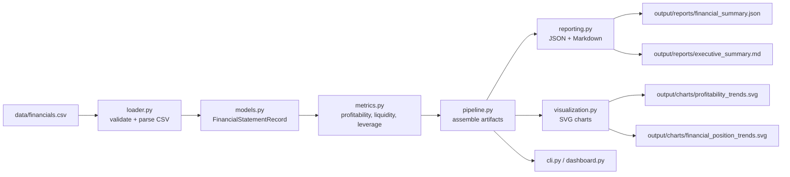
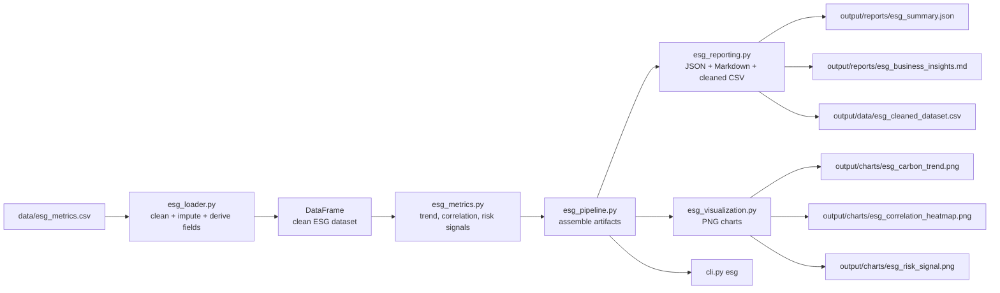

# Data Pipeline

This project contains two related pipelines:

1. Financial statement analysis
2. ESG portfolio analysis

Both pipelines follow the same basic pattern:

```text
CSV input
-> validation / cleaning
-> metric calculation
-> summary assembly
-> reports and charts
```

## Financial Pipeline



### Inputs

Source file:
- `data/financials.csv`

Required fields:
- `period`
- `revenue`
- `cost_of_revenue`
- `operating_expenses`
- `net_income`
- `current_assets`
- `current_liabilities`
- `total_assets`
- `total_liabilities`

### Processing Steps

1. [loader.py](C:/Users/Zixsa/Kozphy/financial-analysis-tool/src/financial_analysis_tool/loader.py)
   - validates required columns
   - parses numeric values
   - sorts periods in `YYYY-Qn` order

2. [metrics.py](C:/Users/Zixsa/Kozphy/financial-analysis-tool/src/financial_analysis_tool/metrics.py)
   - calculates revenue growth
   - calculates gross, operating, and net margin
   - calculates current ratio and debt ratio
   - builds the business summary

3. [pipeline.py](C:/Users/Zixsa/Kozphy/financial-analysis-tool/src/financial_analysis_tool/pipeline.py)
   - coordinates loading, metric calculation, and output generation

4. [reporting.py](C:/Users/Zixsa/Kozphy/financial-analysis-tool/src/financial_analysis_tool/reporting.py)
   - writes JSON and Markdown outputs

5. [visualization.py](C:/Users/Zixsa/Kozphy/financial-analysis-tool/src/financial_analysis_tool/visualization.py)
   - writes SVG charts for trend review

### Outputs

- `output/reports/financial_summary.json`
- `output/reports/executive_summary.md`
- `output/charts/profitability_trends.svg`
- `output/charts/financial_position_trends.svg`

## ESG Pipeline



### Inputs

Source file:
- `data/esg_metrics.csv`

Required fields:
- `company`
- `sector`
- `year`
- `revenue_musd`
- `scope1_emissions_tco2e`
- `scope2_emissions_tco2e`
- `esg_score`
- `environment_score`
- `social_score`
- `governance_score`
- `renewable_energy_pct`
- `green_capex_pct`
- `board_independence_pct`
- `women_board_pct`
- `safety_incidents`
- `controversy_count`

### Processing Steps

1. [esg_loader.py](C:/Users/Zixsa/Kozphy/financial-analysis-tool/src/financial_analysis_tool/esg_loader.py)
   - validates the ESG schema
   - removes duplicate company-year rows
   - fills selected missing values
   - adds row-level imputation audit flags
   - labels the fill source as company history, sector median, or dataset median
   - derives `total_emissions_tco2e`, `carbon_intensity`, `emissions_change_pct`, and `esg_score_change`

2. [esg_metrics.py](C:/Users/Zixsa/Kozphy/financial-analysis-tool/src/financial_analysis_tool/esg_metrics.py)
   - builds sector summaries
   - calculates correlation across key ESG fields
   - constructs latest-year risk signals
   - turns analysis into business-facing insights

3. [esg_pipeline.py](C:/Users/Zixsa/Kozphy/financial-analysis-tool/src/financial_analysis_tool/esg_pipeline.py)
   - coordinates cleaning, analysis, and output generation

4. [esg_reporting.py](C:/Users/Zixsa/Kozphy/financial-analysis-tool/src/financial_analysis_tool/esg_reporting.py)
   - writes JSON, Markdown, and cleaned CSV outputs

5. [esg_visualization.py](C:/Users/Zixsa/Kozphy/financial-analysis-tool/src/financial_analysis_tool/esg_visualization.py)
   - writes PNG charts using matplotlib and seaborn

### Outputs

- `output/reports/esg_summary.json`
- `output/reports/esg_business_insights.md`
- `output/data/esg_cleaned_dataset.csv`
- `output/charts/esg_carbon_trend.png`
- `output/charts/esg_correlation_heatmap.png`
- `output/charts/esg_risk_signal.png`

## Delivery Surfaces

- [cli.py](C:/Users/Zixsa/Kozphy/financial-analysis-tool/src/financial_analysis_tool/cli.py)
  - default command runs the financial pipeline
  - `esg` subcommand runs the ESG pipeline
- [dashboard.py](C:/Users/Zixsa/Kozphy/financial-analysis-tool/src/financial_analysis_tool/dashboard.py)
  - top-level Streamlit launcher for both workflows
- [financial_dashboard.py](C:/Users/Zixsa/Kozphy/financial-analysis-tool/src/financial_analysis_tool/financial_dashboard.py)
  - Streamlit UI for the financial workflow
- [esg_dashboard.py](C:/Users/Zixsa/Kozphy/financial-analysis-tool/src/financial_analysis_tool/esg_dashboard.py)
  - Streamlit UI for ESG review, watchlist analysis, and cleaning audit
- [main.py](C:/Users/Zixsa/Kozphy/financial-analysis-tool/main.py)
  - raw-checkout entrypoint

## Controls And Assumptions

- Financial input must use quarterly labels in `YYYY-Qn` format.
- ESG analysis requires the optional `.[esg]` dependency group.
- ESG missing-value handling is documented and intentional, but it is still an analytical assumption rather than audited source truth.
- Output files are written into `output/charts/`, `output/reports/`, and `output/data/`.

## Related Documents

- [README.md](C:/Users/Zixsa/Kozphy/financial-analysis-tool/README.md)
- [architecture.md](C:/Users/Zixsa/Kozphy/financial-analysis-tool/docs/architecture.md)
- [data_dictionary.md](C:/Users/Zixsa/Kozphy/financial-analysis-tool/docs/data_dictionary.md)
